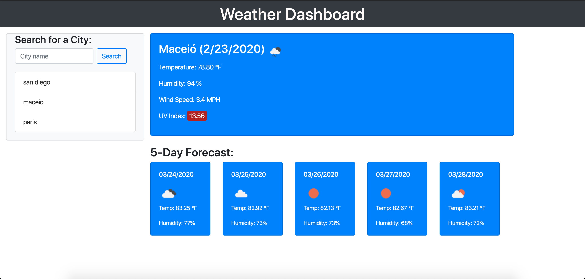

# Weather Forecast
> Weather application allows user to get information about current weather as well as forecast of the next five consecutive days by searching cities by name.

## Table of contents
* [General info](#general-info)
* [Screenshots](#screenshots)
* [Technologies](#technologies)
* [Setup](#setup)
* [Features](#features)
* [Status](#status)
* [Inspiration](#inspiration)
* [Contact](#contact)

## General info
Use the [OpenWeather API](https://openweathermap.org/api) to retrieve weather data for cities.

## Screenshots

## Technologies
* jQuery
* OpenWeatherMap API
* JavaScript
* HTML5
* CSS 

## Setup
This application runs in the browser. Nothing needs to be installed except for your default browser.

* Repository can be found here: [GitHub/ramonpbarros](https://github.com/ramonpbarros/weather-forecast) Make sure to git clone and check out the code!

## Code Examples
`$.ajax({url: queryURL, method: "GET"}).then(function (response) {};`

## Features
List of features:
* Search weather from different cities around the world.
* Creates buttons for each searched city enabling easy access to its information.
* Last searched cities will be set to local storage.

To-do list:
* Make it mobile reponsive.
* Refactor code.

## Status
Project is: _in progress_
* Make sure to check the application [here](https://ramonpbarros.github.io/weather-forecast/).

## Inspiration
Project inspired by UCSD Coding Bootcamp, based on firt month of course, ultilizing OpenWeatherMap API and applying jQuery, CSS and HTML skills.

## Contact
Created by [@ramonpbarros](https://github.com/ramonpbarros) - feel free to contact me!